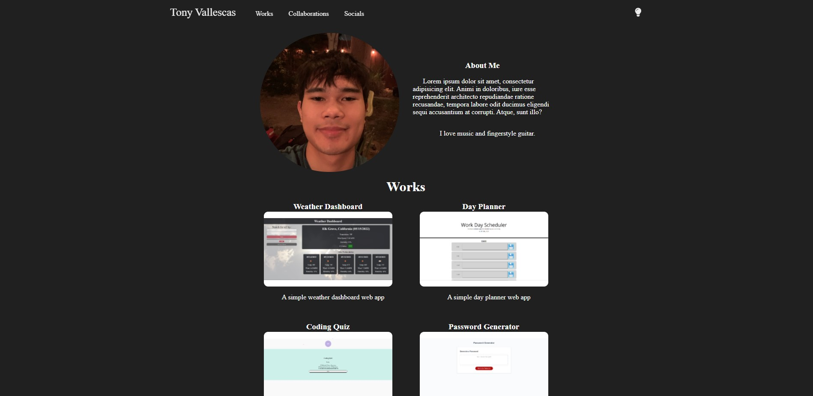

# Updated-Portfolio
Unofficial Portfolio (Week 9)

Deployed Site [here.](https://tonyavall.github.io/Updated-Portfolio/)

Stack: HTML, CSS, JavaScript

## Introduction:
    Updated portfolio page as of Week 9. 
    Key differences being an updated works and collaberations page with a light-dark theme using JavaScript. 
    Dark-theme logic uses localStorage to store user preference. 
    Other implementations include the use of translations and transitions for color and positions.

## Project Notes:
    1. I need to retouch on better HTML format
    2. Need to implement a dropdown menu for mobile
    3. Need to update light theme color scheme and introduce more colors

